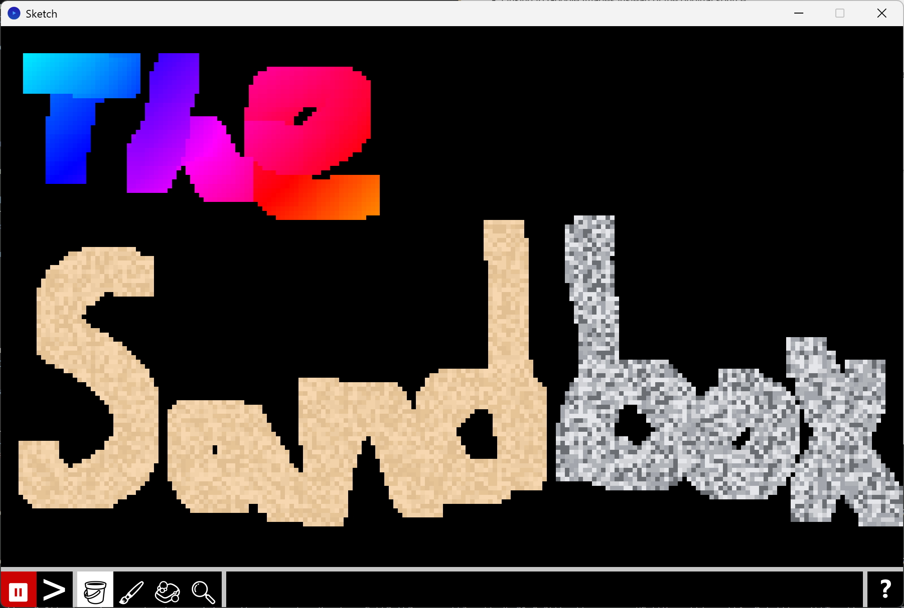

# Sandbox - A Sand Simulation



A falling sand cellular automata game.

## Usage

Use the mouse and paint the canvas with the different types of cells provided in the cell selection panel.

`Space`: Pause or resume the simulation
`s`: Advance the simlation by one frame
`Shift`: Opens up the cell selection panel
`1`: Fill tool (Paints the canvas with the selected cell, does not override existing cells)
`2`: Brush tool (Paints the canvas with the selected cell, overrides existing cell)
`3`: Eraser tool
`F3`: Display debug renderers
`Up/Down Arrow or Scroll`: Increase/decrease brush size

While the cell selection panel is open you can press `Shift` or `Esc` to close it

## Features

- [x] Simulation Controls (pause/play/step)
- [x] Brushes
  - [x] Paint
  - [x] Erase
- [x] Extendable Cell System
- [x] Debug Render
- [ ] Cell Inspection Tool
- [ ] Help Menu
- [ ] Resizeable Canvas

## Attribution

```txt
Noto Emoji Font
Source: https://fonts.google.com/noto/specimen/Noto+Emoji
License: SIL Open Font License, Version 1.1
```
